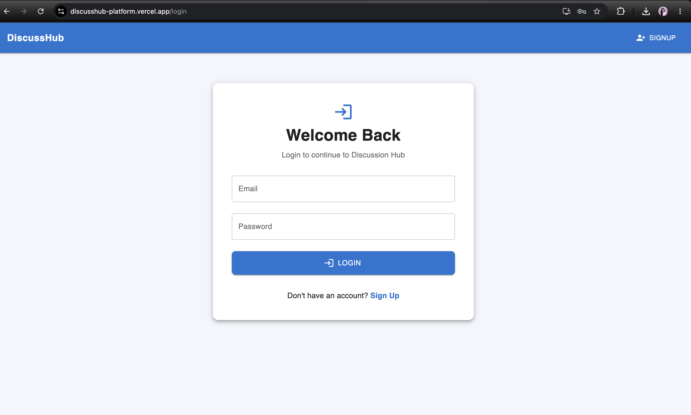
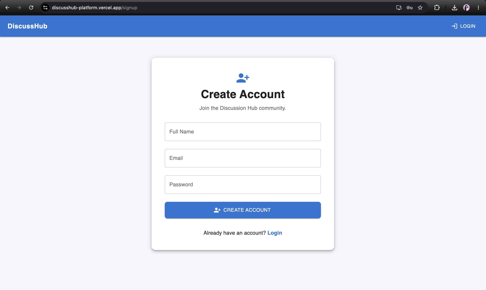
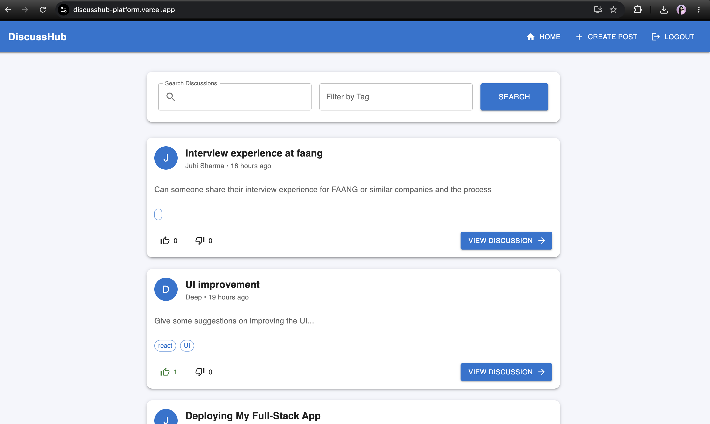
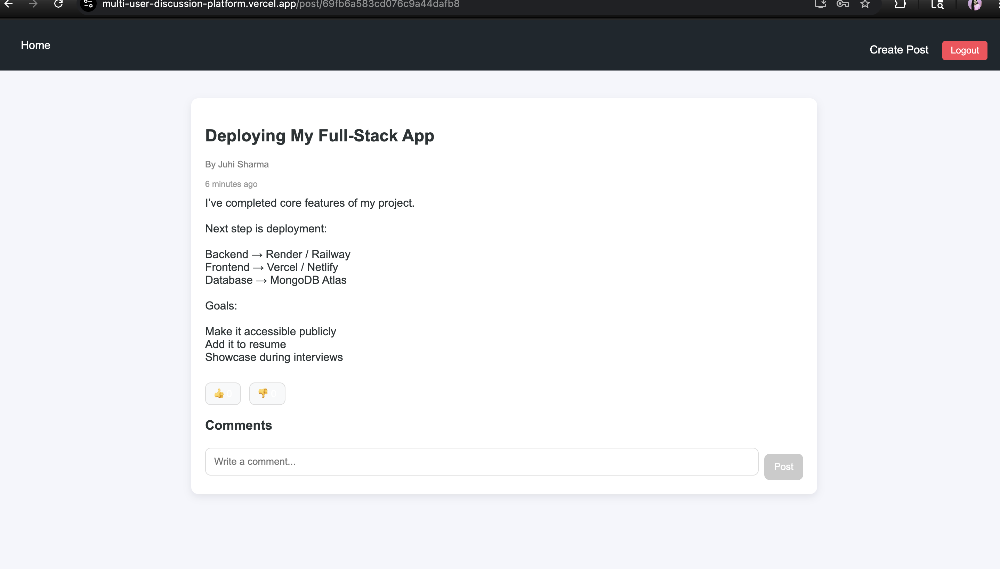
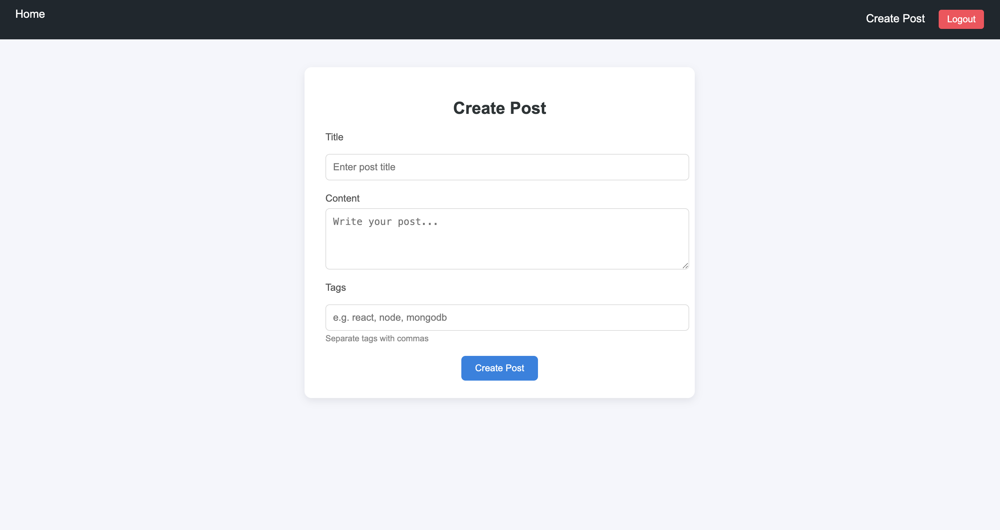

# **DiscussHub**

A full-stack discussion platform inspired by modern community forums where users can create posts, participate in discussions, vote on content, and interact through comments.

Built using **React.js, Node.js, Express.js, MongoDB, and JWT Authentication** with full deployment on **Vercel** and **Render**.

---

# **🚀 Live Demo**

### **Try it here**
[discusshub-platform.vercel.app](https://discusshub-platform.vercel.app/)

---

# **📌 Features**

- 🔐 JWT-based Authentication (Signup/Login)
- 📝 Create and Delete Posts
- 💬 Add and Delete Comments
- 👍 Upvote and 👎 Downvote System
- 🔍 Search Posts by Keywords
- 🏷 Tag-based Filtering
- 🔒 Protected Routes
- 📱 Responsive Modern UI
- ☁️ Full Deployment using Vercel and Render

---

# **🛠 Tech Stack**

## **Frontend**
- React.js
- React Router DOM
- Axios
- CSS3

## **Backend**
- Node.js
- Express.js
- REST APIs
- JWT Authentication

## **Database**
- MongoDB
- Mongoose

## **Deployment**
- Vercel
- Render

---

# **📸 Screenshots**

## **Login Page**

---

## **Signup Page**

---

## **Feed Page**

---

## **Post Details Page**

---

## **Create Post Page**

# **⭐ If you found this project interesting, consider giving it a star!**
